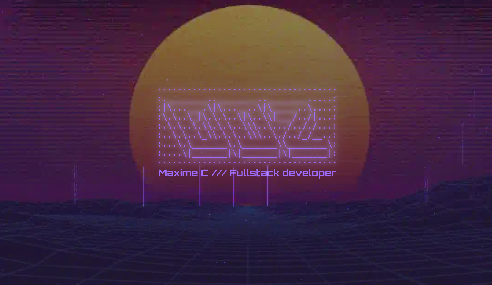

# Dev Folio



Static website built using HTML and sass. You can find the utilities used to build it in `./bin`

## start

This project uses `live-server` and `sass` in development, to start and watch files simply use the following commands:

```shell
pnpm i
```

```shell
pnpm dev
```

## Convert fonts

Utility that converts `woff2` font files to base64 and embed them in a css file, in order for it to work properly font filenames needs to be of the following format: `font-name_weight.woff2` ex: `space-grotesk_500.woff2`

```shell
pnpm build:fonts
```
