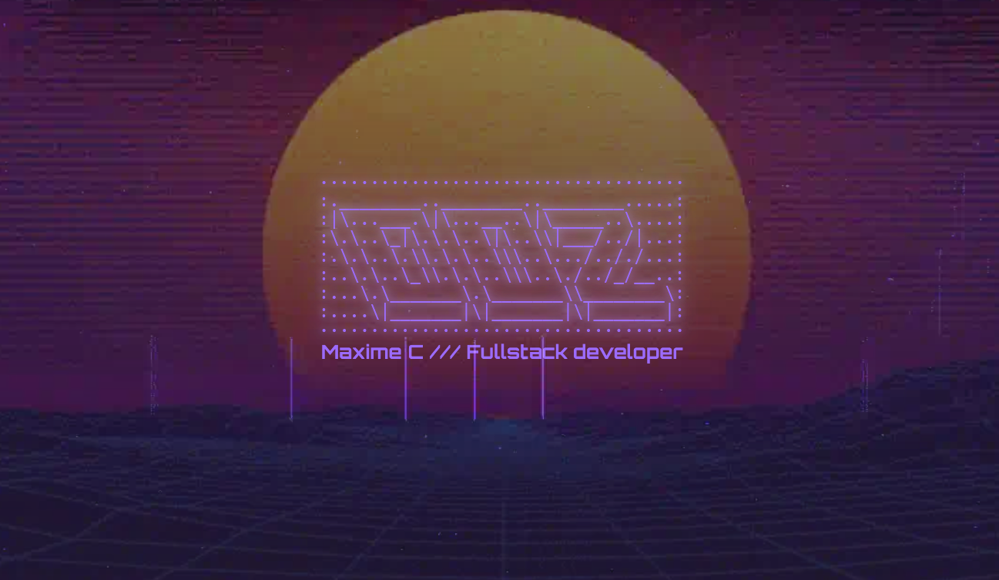

# Dev Folio



Static website built using HTML, sass and JavaScript

live preview available at [d0z.fr](https://d0z.fr)

You can find the utilities used to build it in `./bin`

## start

You'll need [pnpm](https://pnpm.io/) and [Node.js](https://nodejs.org/)

This project uses `live-server` and `sass` in development, to start and watch files simply use the following commands:

```shell
pnpm i
```

```shell
pnpm dev
```

## JavaScript

This project uses some JS

- on the home page (`/`)
  - scroll animation when the "Decouvrir mes projets" button is clicked
  - transition of some elements in the view when the page is scrolled
- on the admin page ('/admin/')
  - navigation between different pages
  - search input
  - login form

## Convert fonts

Utility that converts `woff2` font files to base64 and embed them in a css file, in order for it to work properly font filenames needs to be of the following format: `font-name_weight.woff2` ex: `space-grotesk_500.woff2`

```shell
pnpm build:fonts
```
